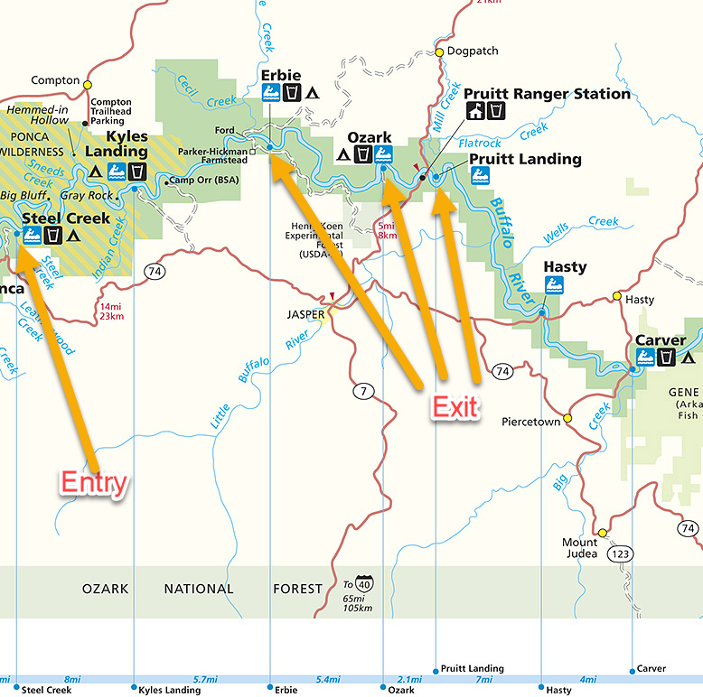

# Buffalo Float Trip 

River Class 1

## Time
7ish pm 05-07-2021 - 7ish pm 05-08-2021

## Camping Friday Night

[Steel Creek](https://www.recreation.gov/camping/campgrounds/10001451) Campground. Tent sites are first come first served so we need to get there asap.

**Distance**: 125mi

**Time**: 2.5hrs

## Location

**Entry** Steel Creek

**Exit**: Erbie, Ozark or Pruitt Landing depending on water conditions. We will decide the morning of the float which exit to leave the truck at.

[**Water levels**](https://www.buffaloriver.com/pages/floating/current-buffalo-river-level/)

[Map](https://www.buffaloriver.com/uploads/pages/buffalo-river-map.jpg)

We will see what the water conditions are when we get there. The distances are below and if the river is slow it maybe 2 m/h but could be up to 5 m/h.

